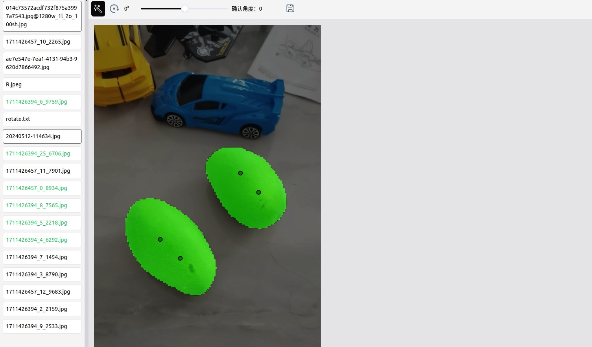

# samc - 分割、角度标注工具


## 构建
### cpu

```bash
cargo run --bin server --features cpu
```
### GPU

```bash
cargo run --bin server --features cuda
```
## 运行
```bash
./server /path/to/images/待标注的目录

USE_TINY=true ./server /path/to/images/待标注的目录 # 使用 mobile-sam 模型

```
### 使用外部分割API
```bash
USE_API=https://example.com/api/sam ./server /path/to/images/待标注的目录

API 需要实现以下请求参数:
```json
{
    "images": "base64编码的图片",
    "inputs":[
        [640, 640, 1],
        [640, 660, 1],
        [640, 680, 0]
    ]
}

> 其中 inputs 是一个二维数组，表示每个输入的坐标，格式为 [height, width, x], x 只能是0 或 1，0表示背景，1表示前景

```
API 只需要返回以下格式即可：
```json
{
    "mask":"base64编码的掩码",
    "inputs":[
        //...
    ]
}
```

